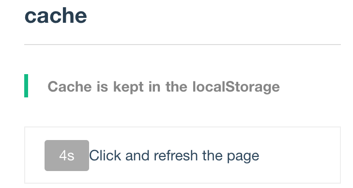

# timer.react

> React,Timer.Custom style!

[](https://travis-ci.org/fast-flow/timer.react)
[](https://npmjs.org/package/timer.react)
[](https://npmjs.org/package/timer.react)


## Install

```shell
npm install timer.react --save
```

## Example

[](http://fast-flow.github.io/timer.react/example)

## Online documentation

[Online](http://fast-flow.github.io/timer.react)

## Change log

[CHANGELOG](./CHANGELOG.md)
